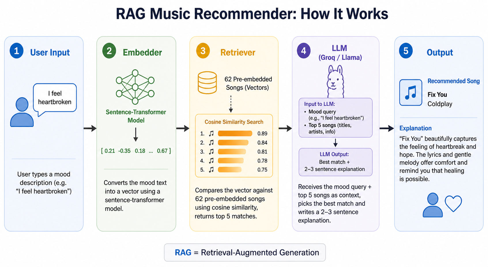

# RAG Music Recommender

## Original Project: [The Mood Machine](https://github.com/Chiamanda07/ai110-module3show-musicrecommendersimulation-starter)

The original project built a small music recommender that represented songs and a user taste profile as data, then used a scoring rule to rank recommendations. It focused on understanding how real-world AI recommenders work by evaluating what the system got right and wrong. This version upgrades it into a full **RAG (Retrieval-Augmented Generation)** system where you type how you are feeling and an LLM picks a song that matches your mood.

---

## Summary

The RAG Music Recommender lets you type how you are feeling in plain English and returns a song that matches your mood. It uses a 62-song database, semantic search, and an LLM to explain why the pick fits. The goal is to show how embedding-based retrieval and language models can work together to give personalized results.

---

## Architecture Overview



1. **User Input** — the user types a mood description in plain English
2. **Embedder** — `all-MiniLM-L6-v2` converts the query into a vector; song embeddings are pre-cached on disk
3. **Retriever** — cosine similarity is computed against all 62 song embeddings and the top 5 matches are returned
4. **LLM (Groq / Llama 3.1)** — receives the mood query and the 5 candidates as context, picks the best match, and writes a 2–3 sentence explanation
5. **Output** — the recommended song title, artist, and explanation are printed to the terminal

---

## Setup Instructions

### 1. Clone the repository

```
git clone https://github.com/Chiamanda07/music_recommende_2.0_project
cd music_recommende_2.0_project
```

### 2. Install dependencies

```
pip install -r requirements.txt
```

### 3. Add your Groq API key

Create a `.env` file in the project root:

```
GROQ_API_KEY=your_api_key_here
```

Get a free key at [console.groq.com](https://console.groq.com) → **API Keys** → **Create API Key**.

### 4. Run the recommender

```
python rag_recommender.py
```

Type how you are feeling and press Enter to get a song recommendation.

---

## Sample Interaction

There's a demo walkthrough of the RAG Music Recommender in this [demo](https://github.com/Chiamanda07/music_recommende_2.0_project/raw/main/assets/demo_video.mp4).

```
============================================================
         Welcome to the RAG Music Recommender
============================================================
Describe how you're feeling and get a song that matches.
Commands: 'another' for a new pick  |  'quit' to exit

How are you feeling? I just went through a breakup and I'm heartbroken

Searching for the right song...

------------------------------------------------------------
SONG: "Someone Like You" by Adele
REASON: This song captures the raw pain of watching someone you loved
move on without you. Adele's vocals carry the exact weight of grief and
acceptance that comes with a fresh heartbreak.
------------------------------------------------------------

Type 'another' for a different pick, a new mood to start over, or 'quit' to exit.
> another

Finding another pick...

------------------------------------------------------------
SONG: "Breakeven" by The Script
REASON: This song speaks directly to the unfair pain of a breakup where
one person walks away fine while the other falls apart. It matches the
feeling of being left behind while the other person moves on.
------------------------------------------------------------
```

---

## Design Decisions

**Why RAG instead of just asking the LLM directly?**
Asking an LLM to recommend a song without context often produces generic or made-up results. RAG grounds the recommendation in a real, curated database so the output is always a real song with a real reason.

**Why sentence-transformers instead of keyword search?**
Keyword search would miss queries like "I feel like the world is moving without me" even though that clearly maps to nostalgic or melancholy songs. Semantic embeddings capture meaning, not just exact words.

**Why cache the song embeddings?**
Embedding 62 songs takes a few seconds and the songs never change between runs. Saving the embeddings to disk means the app loads instantly after the first run.

---

## Testing Summary

**What worked well:**
Clear, single-emotion queries like "I feel happy and want to dance" or "I feel heartbroken" consistently returned relevant songs. The embedding model was strong at matching emotional language even when the exact words didn't appear in the song descriptions.

**What didn't work well:**
Mixed-emotion queries like "lowkey vibing but also kinda sad" confused the retriever. When "sad" appeared alongside positive words, Adele's "Someone Like You" dominated results even when it wasn't the best fit.

**What I learned:**
The quality of the mood descriptions in the song database matters as much as the model itself. Writing more casual, natural-language descriptions would help the retriever match informal user queries better.

---

## Reflection

Building this project taught me that the retrieval step is the most important part of a RAG system. If the wrong songs come back as candidates, no amount of prompt engineering will fix the final output.

The LLM always picks a winner even when none of the candidates are a great fit, which can make bad retrievals look convincing. A future improvement would be adding a confidence check so the system says "I'm not sure" rather than forcing a pick.

Working with AI during this project was helpful for writing mood descriptions quickly, but I had to carefully review each one to make sure the tone was consistent across all 62 songs.

---

## Requirements

- Python 3.9+
- A Groq API key (free at [console.groq.com](https://console.groq.com))
- No database or server setup required

---

## Guardrails

- [x] Raises a clear error if the Groq API key is missing from `.env`
- [x] `.env` is listed in `.gitignore` so the API key is never committed to GitHub
- [x] Re-prompts instead of crashing when the user presses Enter without typing a mood
- [x] Tracks already-suggested songs so `another` never repeats a pick
- [x] Notifies the user when all candidates are exhausted instead of looping forever
- [x] Song embeddings are cached to disk so the app does not re-embed on every run

---

## Implementation Checklist

#### Phase 2.1 — Song Dataset
- [x] Create `songs.py` with a list of songs, each containing: title, artist, genre, and a short mood description
- [x] Cover a wide range of moods: happy, sad, energetic, calm, angry, nostalgic, romantic, anxious, focused, etc.
- [x] Aim for at least 50 songs across different genres

#### Phase 2.2 — Embedding Layer
- [x] Add `sentence-transformers` to `requirements.txt`
- [x] Create `embedder.py` that converts any text string into a vector embedding using a pre-trained model
- [x] Pre-compute embeddings for all songs and cache them so they are not recomputed every run

#### Phase 2.3 — Retrieval System
- [x] Create `retriever.py` that accepts a query string and returns the top-N most similar songs using cosine similarity
- [x] Test retrieval with sample mood queries and verify the results make sense

#### Phase 2.4 — LLM Integration
- [x] Add the `groq` SDK to `requirements.txt`
- [x] Store the Groq API key in a `.env` file and add `.env` to `.gitignore`
- [x] Create `rag_recommender.py` that sends the user's mood query plus the retrieved songs to Groq
- [x] Prompt the LLM to pick the best match and explain in 2–3 sentences why it fits the mood

#### Phase 2.5 — Interactive CLI
- [x] Add an interactive loop to `rag_recommender.py` where the user types their mood and receives a song recommendation
- [x] Display the song title, artist, genre, and the LLM's explanation
- [x] Let the user type `another` to get the next best match or `quit` to exit

#### Phase 2.6 — Testing and Evaluation
- [x] Test with at least 10 diverse mood inputs and record whether the recommendations feel relevant
- [x] Identify at least 3 edge cases where the system struggles (vague moods, conflicting feelings, slang)
- [x] Document findings in `model_card.md`

#### Phase 2.7 — Documentation
- [x] Update `requirements.txt` with all new dependencies
- [x] Update repo structure section of this README to include the new files
- [x] Add a usage example showing a sample mood input and recommendation output

---

## Repo Structure

```plaintext
├── songs.py                      # 62-song database with mood descriptions
├── embedder.py                   # Sentence-transformer embedding + disk cache
├── retriever.py                  # Cosine similarity search over song embeddings
├── rag_recommender.py            # Groq LLM integration and interactive CLI
├── song_embeddings_cache.npz     # Pre-computed song embeddings (auto-generated)
├── dataset.py                    # Original word lists and labeled posts
├── mood_analyzer.py              # Original rule-based mood classifier
├── main.py                       # Runs the original rule-based model
├── ml_experiments.py             # Tiny ML classifier using scikit-learn
├── model_card.md                 # Evaluation findings and reflection
├── requirements.txt              # All dependencies
├── .env                          # API key (not committed to GitHub)
└── .gitignore                    # Excludes .env and cache files
```
